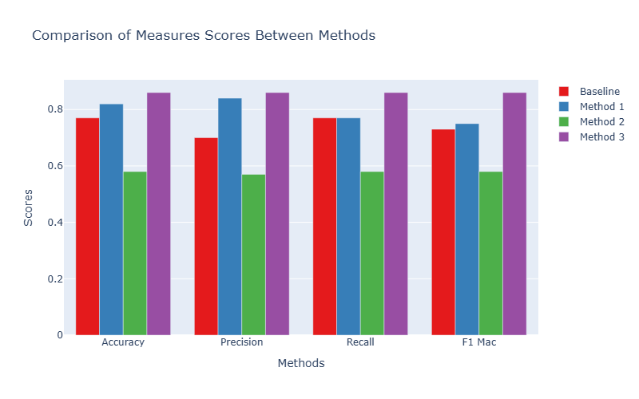
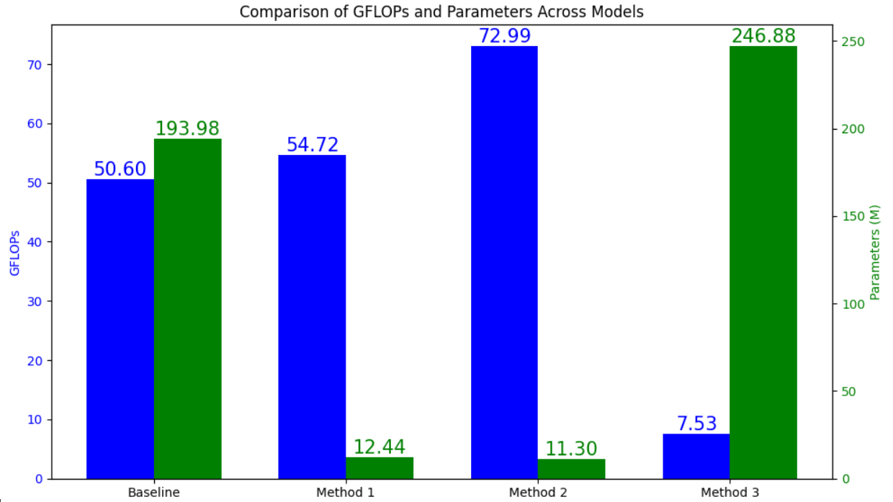

# Harmful Video Classification

This repository contains the final project for **DS201 - Deep Learning in Data Science**. The project builds upon a senior project for harmful video classification and enhances it by achieving improved metrics and faster computation times.

## Overview

Our work revisits the harmful video classification paper and converts the original implementation from a Jupyter Notebook into a Python module for easier integration and deployment. Key improvements include:
- **Enhanced Accuracy and Metrics:** Our model outperforms the baseline on all evaluated metrics.
- **Faster Computation:** Optimized for speed without sacrificing accuracy.
- **Modular Python Code:** Transitioned from a Jupyter Notebook to a fully packaged Python module.

## Comparison Chart

The chart below compares the performance metrics of our improved model against the original baseline:




*Figure: Performance and computation time comparison between the original and improved models.*

## Reference Paper & GitHub

Our implementation is based on the following research paper and its accompanying GitHub repository:
- **Paper:** [Harmful Video Classification (Springer)](https://link.springer.com/chapter/10.1007/978-3-031-75596-5_7)
- **Original GitHub Repository:** [HaMy-DS/Harmful-video-classification](https://github.com/HaMy-DS/Harmful-video-classification)

## Getting Started

### Prerequisites

- Python 3.8+
- [PyTorch](https://pytorch.org/)
- Other dependencies listed in `requirements.txt`

### Installation

Clone the repository and install the required packages:

```bash
git clone https://github.com/yourusername/harmful-video-classification.git
cd harmful-video-classification
pip install -r requirements.txt
